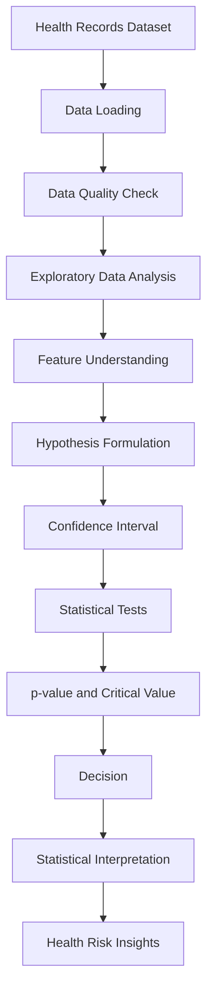

<div align="center">

# 🧠 DERIVABLE JUDGMENT

### Statistical Decision-Making Model for Health & Disease Risk Analysis

> **Turning health records into statistically defensible decisions.**

<br>


<br>

| 👤 Author | 📁 Dataset | 🧾 Records | 🧬 Features | 💻 Language |
|:---:|:---:|:---:|:---:|:---:|
| **Tej Patel** | `health_records.csv` | **1,000** | **15** | **Python** |

[▶ Watch Project Presentation](https://drive.google.com/file/d/1et9Y9jBGedU96IutjZDhjB0n5xIrH8N8/view?usp=sharing) · [📘 Statistical Theory (PDF)](reports/Statistical_Theory.pdf) · [📓 Notebook](notebooks/statistical_analysis.ipynb)

</div>

---

## 📌 Table of Contents

- [Overview](#-overview)
- [Key Highlights](#-key-highlights)
- [Dataset Overview](#-dataset-overview)
- [Project Objectives](#-project-objectives)
- [Statistical Theory](#-statistical-theory)
- [Hypotheses](#-hypotheses)
- [Methodology](#-methodology)
- [Repository Structure](#-repository-structure)
- [Notebook Workflow](#-notebook-workflow)
- [Confidence Intervals](#-confidence-interval-analysis)
- [Statistical Test Results](#-statistical-test-results)
- [Decision Matrix](#-decision-matrix)
- [Visualizations](#-visualizations)
- [Theory → Practice](#-theory--practice-integration)
- [Rough Work / Theory Report](#-rough-work--theory-report)
- [Presentation](#-presentation)
- [Findings](#-results--findings)
- [Final Judgment](#-final-statistical-judgment)
- [Limitations](#-limitations)
- [Implemented vs Future Work](#-implemented-vs-potential-future-work)
- [Installation](#-installation)
- [Reproducibility](#-reproducibility)
- [Learning Outcomes](#-academic-learning-outcomes)
- [Author](#-author)

---

## 🔎 Overview

**Derivable Judgment** is a statistical analysis project that shows how **inferential statistics** can turn raw health records into **evidence-based decisions**. It is built around statistical *reasoning*, not chart production: every result is traced from hypothesis to formula to Python output to a formal decision.

```
Raw Health Data → Data Understanding → Data Cleaning → Exploratory Analysis
      → Hypothesis Formulation → Statistical Testing → Confidence Intervals
      → Critical Values → p-values → Decision Making
      → Statistical Interpretation → Health Risk Insights
```

> 💡 **Core idea:** a judgment is *derivable* when it follows logically from data, a stated hypothesis, a test statistic, and a pre-defined decision rule.

---

## ✨ Key Highlights

| | Highlight |
|:--:|:--|
| 🧪 | **4 formal hypothesis tests**: Welch t-test, Chi-square, One-way ANOVA, Pearson correlation |
| 📏 | **95% confidence intervals** for six key numerical variables |
| 🧮 | Full reporting of **test statistic, critical value, p-value, and decision** for every test |
| 📐 | Covariance and Pearson correlation analysis, including a correlation matrix |
| 📊 | Four statistical visualizations tied directly to the tests |
| 📘 | Supporting **theory report** (`Statistical_Theory.pdf`) behind the practical notebook |
| ⚖️ | Careful language: *fail to reject H₀*, never "accept H₀"; association ≠ causation |

---

## 🗂 Dataset Overview

| Property | Value |
|:--|:--|
| **File** | `data/health_records.csv` |
| **Records** | 1,000 |
| **Features** | 15 |
| **Domain** | Health records / disease risk indicators |

### 📖 Dataset Dictionary

<details open>
<summary><b>Identifier & Date Variables</b></summary>

| Feature | Data Type | Description | Analytical Role |
|:--|:--|:--|:--|
| `record_id` | Identifier | Unique ID for each health record | Record identification (not analysed statistically) |
| `visit_date` | Date | Date of the health visit | Temporal reference |

</details>

<details open>
<summary><b>Numerical Variables</b></summary>

| Feature | Data Type | Description | Analytical Role |
|:--|:--|:--|:--|
| `age` | Numerical | Age of the individual | Confidence interval; Pearson correlation |
| `weight` | Numerical | Body weight | Confidence interval |
| `bmi` | Numerical | Body Mass Index | Welch t-test; CI; correlation |
| `blood_pressure` | Numerical | Blood pressure measurement | Confidence interval |
| `cholesterol_level` | Numerical | Cholesterol measurement | Confidence interval |
| `glucose_level` | Numerical | Glucose measurement | Confidence interval |

</details>

<details open>
<summary><b>Categorical Variables</b></summary>

| Feature | Data Type | Description | Analytical Role |
|:--|:--|:--|:--|
| `age_group` | Categorical | Age category of the individual | ANOVA grouping factor |
| `gender` | Categorical | Gender of the individual | Demographic profiling |
| `region` | Categorical | Geographic region | Demographic profiling |
| `smoking_status` | Categorical | Smoking category | Welch t-test grouping; chi-square factor |
| `exercise_frequency` | Categorical | Exercise habit category | Lifestyle profiling |

</details>

<details open>
<summary><b>Target / Health Indicators</b></summary>

| Feature | Data Type | Description | Analytical Role |
|:--|:--|:--|:--|
| `diabetes` | Binary indicator | Diabetes status | Chi-square outcome; ANOVA response indicator |
| `hypertension` | Binary indicator | Hypertension status | Health-risk indicator |

</details>

---

## 🎯 Project Objectives

1. Understand the health dataset.
2. Perform data quality checks.
3. Explore demographic and health characteristics.
4. Formulate statistical hypotheses.
5. Calculate confidence intervals.
6. Calculate critical values.
7. Calculate p-values.
8. Perform an independent t-test.
9. Perform a chi-square test.
10. Perform one-way ANOVA.
11. Calculate covariance.
12. Calculate Pearson correlation.
13. Visualize important relationships.
14. Interpret statistical significance.
15. Convert statistical results into evidence-based judgments.

---

## 📚 Statistical Theory

### 1️⃣ Inferential Statistics

| Term | Meaning |
|:--|:--|
| **Population** | The entire group about which conclusions are desired |
| **Sample** | The subset of the population actually observed |
| **Parameter** | A numerical characteristic of the population (e.g. μ, σ) |
| **Statistic** | A numerical characteristic of the sample (e.g. x̄, s) |
| **Sampling** | The process of selecting observations from the population |
| **Statistical Inference** | Drawing conclusions about a population from sample evidence |


### 2️⃣ Hypothesis Testing

| Component | Description |
|:--|:--|
| **Null hypothesis (H₀)** | Default claim of no effect, no difference, or no association |
| **Alternative hypothesis (H₁)** | The claim supported if the evidence is strong enough |
| **Significance level (α)** | Maximum tolerated probability of a Type I error (α = 0.05 here) |
| **Test statistic** | A value computed from sample data to measure departure from H₀ |
| **Critical value** | Threshold that marks the boundary of the rejection region |
| **p-value** | Probability of a result at least as extreme as observed, assuming H₀ is true |
| **Decision rule** | Reject H₀ if p < α, or if the test statistic falls in the rejection region |
| **Conclusion** | Interpretation of the decision in the context of the problem |

Generic standardized test statistic:

$$
\text{Test Statistic} = \frac{\text{Observed Statistic} - \text{Hypothesized Value}}{\text{Standard Error}}
$$

Welch's t-statistic (unequal variances):

$$
t = \frac{\bar{x}_1 - \bar{x}_2}{\sqrt{\dfrac{s_1^2}{n_1} + \dfrac{s_2^2}{n_2}}}
$$

### 3️⃣ Confidence Interval

$$
\text{CI} = \text{Statistic} \pm \text{Critical Value} \times \text{Standard Error}
$$

For a population mean with unknown σ:

$$
\text{CI} = \bar{x} \pm t^{*} \cdot \frac{s}{\sqrt{n}}
$$

| Term | Meaning |
|:--|:--|
| **Confidence level** | Long-run proportion of such intervals expected to capture the true parameter (95% here) |
| **Standard error** | $SE = s/\sqrt{n}$, the variability of the sample mean |
| **Margin of error** | $t^{*} \times SE$ |
| **95% CI interpretation** | If the sampling procedure were repeated many times, about 95% of the intervals built this way would contain the true mean. It does **not** mean there is a 95% probability that the true mean lies in one specific computed interval. |

### 4️⃣ p-value

| ✅ A p-value **is** | ❌ A p-value **is not** |
|:--|:--|
| The probability of data at least this extreme, *assuming H₀ is true* | The probability that H₀ is true |
| A measure of compatibility between data and H₀ | A measure of effect size or practical importance |
| Compared against α to reach a decision | Proof of causation |

```
p <  0.05  →  Reject H₀
p ≥  0.05  →  Fail to Reject H₀
```

### 5️⃣ Critical Value

The **critical value** divides the sampling distribution of the test statistic into:

- **Rejection (critical) region**: values extreme enough that H₀ is rejected at level α.
- **Non-rejection region**: values consistent with H₀.

For a two-tailed test at α = 0.05, each tail holds α/2 = 0.025 of the probability. If the test statistic falls in a tail beyond the critical value, H₀ is rejected. This is equivalent to p < α.

### 6️⃣ Type I and Type II Errors

|  | **H₀ True** | **H₀ False** |
|:--|:--:|:--:|
| **Reject H₀** | ❌ **Type I error** (α) | ✅ Correct decision (power = 1 − β) |
| **Fail to Reject H₀** | ✅ Correct decision | ❌ **Type II error** (β) |

### 7️⃣ Statistical Tests at a Glance

| Test | Purpose | Data Type | Main Assumptions | Example in This Project |
|:--|:--|:--|:--|:--|
| **z-test** | Compare a mean to a value when σ is known or n is large | Numerical | Known σ (or large n); independent observations | *Theory only* (covered in the theory report) |
| **t-test** | Compare means of two groups | Numerical vs. 2 groups | Independent observations; approximately normal means; Welch variant does not require equal variances | BMI: smokers vs. non-smokers |
| **Chi-square** | Test independence of two categorical variables | Categorical × Categorical | Independent observations; adequate expected counts | Smoking status × Diabetes |
| **ANOVA** | Compare means across 3 or more groups | Numerical vs. ≥3 groups | Independence; approximately normal residuals; homogeneous variances | Diabetes indicator across age groups |
| **Correlation** | Measure the linear association of two numerical variables | Numerical × Numerical | Linear relationship; no extreme outliers; approximate bivariate normality (for inference) | Age vs. BMI |

### 8️⃣ Covariance

$$
\text{Cov}(X, Y) = \frac{\sum_{i=1}^{n}(X_i - \bar{X})(Y_i - \bar{Y})}{n-1}
$$

| Sign | Interpretation |
|:--:|:--|
| **Positive** | X and Y tend to increase together |
| **Negative** | When one increases, the other tends to decrease |
| **Near zero** | No consistent *linear* co-movement |

> Covariance depends on the units of X and Y, so its magnitude is hard to compare across variables. Correlation fixes this by standardizing.

### 9️⃣ Pearson Correlation

$$
r = \frac{\text{Cov}(X, Y)}{\sigma_X \, \sigma_Y}
$$

| Value | Meaning |
|:--:|:--|
| **r = +1** | Perfect positive linear relationship |
| **r = 0** | No linear relationship |
| **r = −1** | Perfect negative linear relationship |

---

## ❓ Hypotheses

All tests use **α = 0.05**.

| # | Question | H₀ | H₁ | Test |
|:--:|:--|:--|:--|:--|
| **1** | BMI and Smoking | Mean BMI of smokers and non-smokers is equal | Mean BMI of smokers and non-smokers is different | Independent **Welch t-test** |
| **2** | Smoking and Diabetes | Smoking status and diabetes status are independent | Smoking status and diabetes status are associated | **Chi-square** test of independence |
| **3** | Age Group and Diabetes | Mean diabetes indicator is the same across age groups | At least one age group differs | **One-way ANOVA** |
| **4** | Age and BMI | No linear correlation between age and BMI | Significant linear correlation between age and BMI | **Pearson correlation** |

> ⚠️ **Note on Hypothesis 3.** One-way ANOVA is included because it is required for the academic statistical exercise. For a **binary** health outcome such as diabetes, **logistic regression** or categorical methods (e.g. chi-square) are generally more appropriate in real-world epidemiological modeling. The ANOVA result here should be read as an academic demonstration.

---

## 🧭 Methodology



---

## 🗃 Repository Structure

```text
DERIVABLE-JUDGMENT/
│
├── README.md
│
├── data/
│   └── health_records.csv
│
├── notebooks/
│   └── statistical_analysis.ipynb
│
├── reports/
│   └── Statistical_Theory.pdf
│
├── visualizations/
│   ├── age_group_diabetes.png
│   ├── confidence_intervals.png
│   ├── correlation_heatmap.png
│   └── smoking_diabetes.png
│
├── results.csv
│
├── requirements.txt
│
└── presentation/
    └── presentation_video_link.md
```

| Path | Description |
|:--|:--|
| `README.md` | Project documentation (this file) |
| `data/health_records.csv` | Source dataset: 1,000 records × 15 features |
| `notebooks/statistical_analysis.ipynb` | Complete analysis: cleaning, EDA, CIs, tests, visualizations, conclusion |
| `reports/Statistical_Theory.pdf` | Handwritten/rough theory work supporting the notebook |
| `visualizations/` | Charts generated by the notebook |
| `results.csv` | Tabulated results of the analysis |
| `requirements.txt` | Python dependencies |
| `presentation/presentation_video_link.md` | Link to the project presentation video |

---

## 📓 Notebook Workflow

| # | Section | # | Section |
|:--:|:--|:--:|:--|
| 1 | Library Imports | 10 | Welch t-test |
| 2 | Dataset Loading | 11 | Chi-square Test |
| 3 | Dataset Inspection | 12 | One-way ANOVA |
| 4 | Data Quality Check | 13 | Covariance |
| 5 | Descriptive Statistics | 14 | Pearson Correlation |
| 6 | Categorical Analysis | 15 | Correlation Matrix |
| 7 | Numerical Analysis | 16 | Statistical Visualization |
| 8 | Hypothesis Formulation | 17 | Final Decision |
| 9 | Confidence Interval Calculation | 18 | Conclusion |

> The snippets below are **representative examples** of each technique. Category labels and column encodings should match those in your notebook.

<details>
<summary><b>🔹 Confidence Interval (95%)</b></summary>

```python
import numpy as np
from scipy import stats

def confidence_interval(series, confidence=0.95):
    data = series.dropna()
    n = len(data)
    mean = data.mean()
    se = stats.sem(data)                        # s / sqrt(n)
    t_crit = stats.t.ppf((1 + confidence) / 2, df=n - 1)
    margin = t_crit * se
    return mean, mean - margin, mean + margin

mean, lower, upper = confidence_interval(df["bmi"])
```

</details>

<details>
<summary><b>🔹 Welch Independent t-test (BMI × Smoking)</b></summary>

```python
smokers     = df.loc[df["smoking_status"] == "Smoker", "bmi"].dropna()
non_smokers = df.loc[df["smoking_status"] == "Non-smoker", "bmi"].dropna()

t_stat, p_value = stats.ttest_ind(smokers, non_smokers, equal_var=False)  # Welch

alpha = 0.05
decision = "Reject H0" if p_value < alpha else "Fail to Reject H0"
```

</details>

<details>
<summary><b>🔹 Chi-square Test of Independence (Smoking × Diabetes)</b></summary>

```python
import pandas as pd

contingency = pd.crosstab(df["smoking_status"], df["diabetes"])
chi2, p_value, dof, expected = stats.chi2_contingency(contingency)

chi2_critical = stats.chi2.ppf(1 - 0.05, dof)
```

</details>

<details>
<summary><b>🔹 One-way ANOVA (Diabetes indicator × Age group)</b></summary>

```python
groups = [g["diabetes"].values for _, g in df.groupby("age_group")]
f_stat, p_value = stats.f_oneway(*groups)

k, N = len(groups), len(df)
f_critical = stats.f.ppf(1 - 0.05, dfn=k - 1, dfd=N - k)
```

</details>

<details>
<summary><b>🔹 Covariance & Pearson Correlation (Age × BMI)</b></summary>

```python
cov_matrix = np.cov(df["age"], df["bmi"], ddof=1)   # sample covariance (n-1)
covariance = cov_matrix[0, 1]

r, p_value = stats.pearsonr(df["age"], df["bmi"])

corr_matrix = df.select_dtypes("number").corr(method="pearson")
```

</details>

---

## 📏 Confidence Interval Analysis

95% confidence intervals were computed for the following numerical variables using:

$$
\text{CI} = \bar{x} \pm t^{*} \times \frac{s}{\sqrt{n}}
$$

Each interval uses the **sample mean**, **standard deviation**, **standard error**, and the **t critical value** (df = n − 1) to obtain the **lower** and **upper bounds**.

| Variable | Mean | 95% CI Lower | 95% CI Upper |
|:--|:--:|:--:|:--:|
| Age | *see notebook / `results.csv`* | *see notebook* | *see notebook* |
| Weight | *see notebook / `results.csv`* | *see notebook* | *see notebook* |
| BMI | *see notebook / `results.csv`* | *see notebook* | *see notebook* |
| Blood Pressure | *see notebook / `results.csv`* | *see notebook* | *see notebook* |
| Cholesterol Level | *see notebook / `results.csv`* | *see notebook* | *see notebook* |
| Glucose Level | *see notebook / `results.csv`* | *see notebook* | *see notebook* |

> 📝 **Before publishing:** replace the placeholders above with the exact values from your notebook output or `results.csv`.

---

## 🧪 Statistical Test Results

All tests are evaluated at **α = 0.05**.

### 🔹 Welch Independent t-test: BMI × Smoking

| | |
|:--|:--|
| **Purpose** | Compare mean BMI between smokers and non-smokers |
| **t-statistic** | ≈ −2.2565 |
| **p-value** | ≈ 0.0246 |
| **Critical t** | ≈ 1.9658 (two-tailed) |
| **Decision** | ✅ **Reject H₀** |

> **Interpretation:** There is statistically significant evidence that mean BMI differs between smokers and non-smokers in this dataset.

---

### 🔹 Chi-square Test: Smoking × Diabetes

| | |
|:--|:--|
| **Purpose** | Determine whether smoking status and diabetes are associated |
| **χ²** | ≈ 0.9509 |
| **p-value** | ≈ 0.6216 |
| **Critical χ²** | ≈ 5.9915 (corresponds to df = 2) |
| **Decision** | ⚪ **Fail to Reject H₀** |

> **Interpretation:** There is insufficient statistical evidence of an association between smoking status and diabetes in this dataset.

---

### 🔹 One-way ANOVA: Diabetes Indicator × Age Group

| | |
|:--|:--|
| **Purpose** | Compare the diabetes indicator across age groups |
| **F-statistic** | ≈ 3.2674 |
| **p-value** | ≈ 0.0113 |
| **Critical F** | ≈ 2.3809 |
| **Decision** | ✅ **Reject H₀** |

> **Interpretation:** There is statistically significant evidence that the mean diabetes indicator differs across at least one age group.

---

### 🔹 Pearson Correlation: Age × BMI

| | |
|:--|:--|
| **Purpose** | Test for a linear relationship between age and BMI |
| **r** | ≈ 0.2570 |
| **p-value** | ≈ 1.49 × 10⁻¹⁶ |
| **Decision** | ✅ **Reject H₀** |

> **Interpretation:** There is a statistically significant **positive** linear relationship between age and BMI, although the strength of the relationship is relatively **weak**.

---

## 🧾 Decision Matrix

| Test | Statistic | p-value | Critical Value | Decision | Interpretation |
|:--|:--:|:--:|:--:|:--:|:--|
| **Welch t-test** (BMI × Smoking) | t ≈ −2.2565 | 0.0246 | ≈ 1.9658 | ✅ Reject H₀ | Mean BMI differs between smokers and non-smokers |
| **Chi-square** (Smoking × Diabetes) | χ² ≈ 0.9509 | 0.6216 | ≈ 5.9915 | ⚪ Fail to Reject H₀ | Insufficient evidence of association |
| **One-way ANOVA** (Age Group × Diabetes) | F ≈ 3.2674 | 0.0113 | ≈ 2.3809 | ✅ Reject H₀ | Diabetes indicator differs across at least one age group |
| **Pearson r** (Age × BMI) | r ≈ 0.2570 | ≈ 1.49 × 10⁻¹⁶ | n/a (decision by p-value) | ✅ Reject H₀ | Significant, weak positive linear relationship |

**Legend:** ✅ Reject H₀ (p < 0.05) · ⚪ Fail to Reject H₀ (p ≥ 0.05)

---

## 📊 Visualizations

<table>
<tr>
<td align="center" width="50%">
<b>Age Group vs Diabetes</b><br><br>

</td>
<td align="center" width="50%">
<b>Smoking Status vs Diabetes</b><br><br>

</td>
</tr>
<tr>
<td align="center" width="50%">
<b>Confidence Intervals</b><br><br>

</td>
<td align="center" width="50%">
<b>Correlation Heatmap</b><br><br>

</td>
</tr>
</table>

<details>
<summary><b>Click to expand visualization details</b></summary>

| Visualization | Purpose | Variables | What It Helps Understand | Statistical Relevance |
|:--|:--|:--|:--|:--|
| **Age Group vs Diabetes** | Compare diabetes occurrence across age categories | `age_group`, `diabetes` | How diabetes indicator patterns shift with age group | Visual companion to the one-way ANOVA |
| **Smoking Status vs Diabetes** | Compare diabetes distribution across smoking categories | `smoking_status`, `diabetes` | Whether diabetes proportions look similar across smoking groups | Visual companion to the chi-square test |
| **Confidence Intervals** | Display mean estimates with their uncertainty | `age`, `weight`, `bmi`, `blood_pressure`, `cholesterol_level`, `glucose_level` | Precision of each estimated mean | Shows the interval estimates from the CI analysis |
| **Correlation Heatmap** | Summarize pairwise linear relationships | Numerical variables | Which variables move together, and how strongly | Context for covariance and Pearson correlation (e.g. age × BMI) |

</details>

---

## 🔗 Theory ↔ Practice Integration

```
THEORY → Hypothesis → Mathematical Formula → Python Implementation
      → Statistical Output → Decision → Real Interpretation
```

| Concept | Theory | Python Implementation | Output | Decision |
|:--|:--|:--|:--|:--|
| **Confidence Interval** | $\bar{x} \pm t^*\,s/\sqrt{n}$ | `stats.t.ppf`, `stats.sem` | Lower and upper bounds per variable | Estimate precision of each mean |
| **t-test (Welch)** | $t=\dfrac{\bar x_1-\bar x_2}{\sqrt{s_1^2/n_1+s_2^2/n_2}}$ | `stats.ttest_ind(..., equal_var=False)` | t ≈ −2.2565, p ≈ 0.0246 | Reject H₀ |
| **Chi-square** | $\chi^2=\sum\dfrac{(O-E)^2}{E}$ | `stats.chi2_contingency` | χ² ≈ 0.9509, p ≈ 0.6216 | Fail to Reject H₀ |
| **ANOVA** | $F=\dfrac{MS_{between}}{MS_{within}}$ | `stats.f_oneway` | F ≈ 3.2674, p ≈ 0.0113 | Reject H₀ |
| **Covariance** | $\dfrac{\sum(X_i-\bar X)(Y_i-\bar Y)}{n-1}$ | `np.cov` | Covariance of age and BMI (see notebook) | Direction of co-movement |
| **Correlation** | $r=\dfrac{\text{Cov}(X,Y)}{\sigma_X\sigma_Y}$ | `stats.pearsonr` | r ≈ 0.2570, p ≈ 1.49×10⁻¹⁶ | Reject H₀ |
| **p-value** | $P(\text{data at least as extreme}\mid H_0)$ | Returned by SciPy tests | Per-test p-value | Reject if p < 0.05 |
| **Critical value** | Boundary of the rejection region at α | `stats.t.ppf`, `stats.chi2.ppf`, `stats.f.ppf` | 1.9658 · 5.9915 · 2.3809 | Compare to test statistic |

---

## 📝 Rough Work / Theory Report

The repository includes handwritten/rough theoretical work in [`reports/Statistical_Theory.pdf`](reports/Statistical_Theory.pdf). It serves as the **theoretical foundation** behind the practical notebook and covers:

- Inferential statistics
- Hypothesis testing
- Confidence intervals
- Critical values
- p-values
- Type I and Type II errors
- z-test, t-test, chi-square, ANOVA
- Covariance and correlation
- Dataset hypotheses
- Statistical calculations
- Decision-making flow

---


## 🔬 Results & Findings

1. **BMI** showed a statistically significant difference between smokers and non-smokers.
2. **Smoking and diabetes** did not show a statistically significant association in this dataset.
3. The **diabetes indicator** differed significantly across age groups.
4. **Age and BMI** showed a statistically significant positive correlation (weak in strength, r ≈ 0.2570).
5. Statistical significance does **not** automatically imply practical or clinical importance.
6. Results are specific to this dataset and should not be generalized without further validation.

> ⚠️ **Statistical significance ≠ Causation ≠ Clinical significance.**

---

## ⚖️ Final Statistical Judgment

```text
┌──────────────────────────────────────────────┐
│             STATISTICAL JUDGMENT             │
├──────────────────────────────────────────────┤
│  BMI vs Smoking        →  SIGNIFICANT        │
│  Smoking vs Diabetes   →  NOT SIGNIFICANT    │
│  Age Group vs Diabetes →  SIGNIFICANT        │
│  Age vs BMI            →  SIGNIFICANT        │
└──────────────────────────────────────────────┘
```

This project demonstrates how statistical evidence (a hypothesis, a test statistic, a critical value, and a p-value) can support **defensible analytical decisions**. Each judgment follows from a stated decision rule, not from visual impression alone.

---

## 🚧 Limitations

- The dataset represents a **finite sample**.
- Statistical **association does not establish causation**.
- Results depend on **data quality**.
- Some variables may involve **unobserved confounding factors**.
- Statistical significance **does not imply clinical significance**.
- This is an **educational/analytical** project, **not a medical diagnosis system**.
- Real-world health decisions require **validated clinical studies and domain expertise**.

---

## 🗺 Implemented vs Potential Future Work

<table>
<tr>
<th width="50%">✅ Implemented</th>
<th width="50%">🔭 Potential Future Work</th>
</tr>
<tr>
<td valign="top">

- Data loading, inspection, and quality checks
- Descriptive statistics (categorical and numerical)
- 95% confidence intervals
- Welch independent t-test
- Chi-square test of independence
- One-way ANOVA
- Covariance and Pearson correlation
- Correlation matrix
- Statistical visualizations
- Decision-based interpretation

</td>
<td valign="top">

- Logistic regression
- Multiple linear regression
- Random forest
- Feature importance
- ROC-AUC analysis
- Predictive modeling
- Larger real-world datasets
- Longitudinal health analysis
- Interactive Power BI dashboard
- Statistical model comparison
- Multivariate hypothesis testing
- Automated statistical reporting

</td>
</tr>
</table>

> The right-hand column lists **ideas only**. None of these have been implemented in this project.

---

## 🛠 Technology Stack


---

## ⚙️ Installation

**Requirements:** Python 3.x · pandas · numpy · scipy · matplotlib · seaborn · jupyter (listed in `requirements.txt`)

```bash
# 1. Clone the repository
git clone <repository-url>
cd DERIVABLE-JUDGMENT

# 2. Create a virtual environment
python -m venv venv
```

Activate the environment:

```bash
# Windows
venv\Scripts\activate

# macOS / Linux
source venv/bin/activate
```

```bash
# 3. Install dependencies
pip install -r requirements.txt

# 4. Launch Jupyter
jupyter notebook
```

**Running the analysis:** open `notebooks/statistical_analysis.ipynb` and choose **Kernel → Restart & Run All** (or run the cells in order). The notebook reads `data/health_records.csv` and regenerates all statistics and figures.

---

## 🔁 Reproducibility

- The dataset is provided in `data/`.
- The notebook contains the complete analysis.
- Statistical calculations are deterministic and reproducible.
- Results can be regenerated by re-running the notebook.
- Visualizations can be recreated by running the notebook cells.

---

## 🎓 Academic Learning Outcomes

| Skill | Demonstrated Through |
|:--|:--|
| **Statistical thinking** | Framing health questions as testable statistical claims |
| **Inferential reasoning** | Moving from sample evidence to population-level conclusions |
| **Hypothesis formulation** | Explicit H₀/H₁ for four research questions |
| **Statistical testing** | Welch t-test, chi-square, ANOVA, Pearson correlation |
| **Mathematical interpretation** | Formulas, critical values, p-values, and confidence intervals |
| **Python implementation** | Pandas, NumPy, and SciPy workflows |
| **Data visualization** | Matplotlib and Seaborn charts tied to the tests |
| **Evidence-based decision making** | Decision rules leading to documented judgments |

---


## 🎬 Presentation

**Topic:** *Derivable Judgment — Statistical Decision-Making Model*

[▶ Watch Project Presentation](https://drive.google.com/file/d/1et9Y9jBGedU96IutjZDhjB0n5xIrH8N8/view?usp=sharing)

> The video is hosted on Google Drive and is linked from this repository. The link is also stored in `presentation/presentation_video_link.md`.

---

## 👤 Author

### Tej Patel

**Statistical Analysis & Data Analytics Project**

> *"Built to demonstrate how statistical theory, computational analysis, and evidence-based reasoning can transform raw health data into defensible analytical judgments."*

---

<div align="center">

**DERIVABLE JUDGMENT** · Statistical Decision-Making Model for Health & Disease Risk Analysis

<sub>⚠️ Educational and analytical project. Not intended for medical diagnosis or clinical decision-making.</sub>

</div>